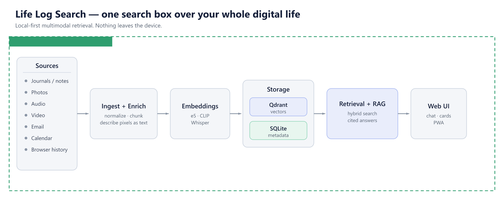
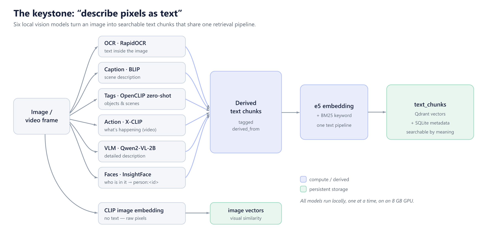
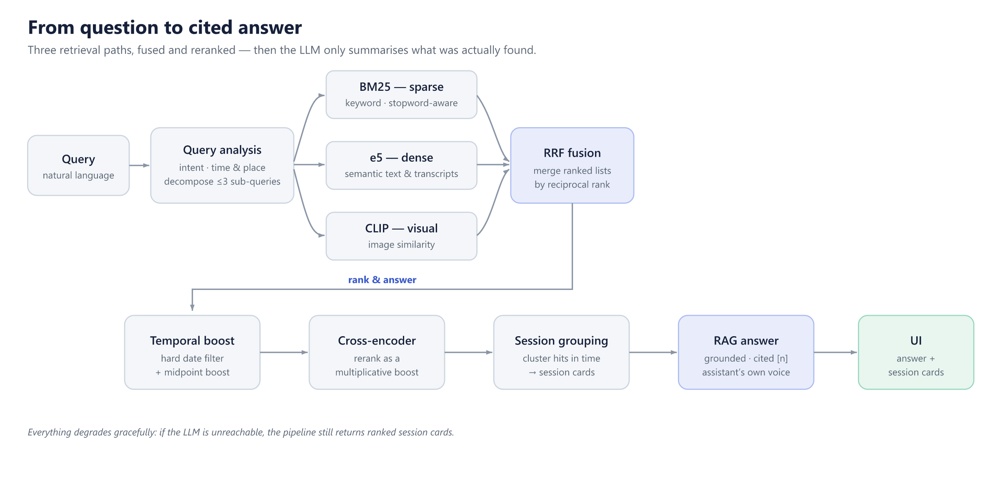

# Life Log Search

**Local-first, multimodal personal search over your whole digital life — and nothing leaves your machine.**

Life Log Search ingests your journals, photos, audio, video, email, calendar exports, and browser history, makes all of it searchable by *meaning*, and answers natural-language questions about your own life with grounded, cited answers. Every model — embeddings, vision, transcription, and the answer LLM — runs locally. After setup, normal operation requires no third-party APIs.

> Ask *"the screenshot with the wifi password,"* *"what did the whiteboard from the brainstorm say?"*, or *"the voice memo where I planned the trip"* — and get the right moment back, across modalities, by what's *in* it rather than its filename.



---

## Highlights

- **Truly multimodal** — one search box over text, photos, audio, video, email, calendar, and browser history.
- **"Describe pixels as text"** — images and video are enriched locally (OCR, captions, zero-shot tags, action recognition, a vision-language model, and faces) into derived text chunks, so a single retrieval pipeline serves every modality. CLIP keeps a separate lane for pure visual similarity.
- **Hybrid retrieval** — BM25 (sparse) + e5 (dense semantic) + CLIP (visual), merged with reciprocal-rank fusion, refined by a temporal boost and a cross-encoder reranker, then grouped into session cards.
- **RAG answers** — a local LLM (via Ollama) synthesizes grounded, cited natural-language answers from the top results, with query decomposition for complex questions. Degrades gracefully to ranked cards if the LLM is offline.
- **Faces** — auto-clustered with InsightFace; name a cluster once and it becomes searchable (`person:<id>`).
- **Proactive** — "on this day," daily/weekly digests, auto session titles, and deterministic insights (top places, busiest weekday/month, recurring patterns).
- **Private by design** — SQLite metadata, Qdrant vectors, models, and logs all stay on your machine.
- **Reachable from your phone** — an installable PWA front end proxies same-origin `/api` calls through a tunnel to the local backend, gated by an app password. Only the query and the results ever cross the wire — never your files.

---

## How it works

```text
                          ┌──────────────  YOUR MACHINE — strictly local  ──────────────┐
                          │                                                             │
 Sources                  │   Ingest + Enrich        Embeddings        Storage          │
 ─ journals / notes  ─────►   normalize · chunk  ──►  e5 · CLIP   ──►  Qdrant (vectors)  │
 ─ photos                 │   describe pixels        Whisper           SQLite (metadata) │
 ─ audio / video          │   as text                                       │           │
 ─ email                  │                                                 ▼           │
 ─ calendar               │                          Retrieval + RAG  ◄─────┘           │
 ─ browser history        │   query ─► analysis ─► [BM25 · e5 · CLIP] ─► RRF fusion      │
                          │           ─► temporal boost ─► cross-encoder ─► group        │
                          │           ─► cited answer ─► Web UI / PWA                     │
                          └─────────────────────────────────────────────────────────────┘
```

The core idea is **"describe pixels as text":** rather than maintaining a separate search stack per modality, non-text content is converted into derived text chunks (tagged `derived_from`) that flow into the same embedding-and-ranking pipeline as everything else. Adding a new modality means implementing **one ingestor class** — retrieval never changes.



A query runs three retrieval paths in parallel — BM25 (sparse), dense e5 (semantic), and CLIP (visual) — merged with reciprocal-rank fusion, refined by a temporal boost and a cross-encoder reranker, then grouped into session cards before a local LLM writes a grounded, cited answer.



Because everything runs on a single consumer GPU, the heavy models **take turns**: enrichment runs as a low-priority background pass that yields the GPU to live queries.

---

## Tech stack

- **API:** FastAPI · **Scheduling:** APScheduler · **File watching:** Watchdog
- **Vector store:** Qdrant (Docker, server mode) · **Metadata:** SQLite
- **Front end:** Next.js (installable PWA)
- **Local model suite:**
  - Text embeddings — `intfloat/e5-large-v2`
  - Image/text embeddings — OpenCLIP `ViT-L-14`
  - Transcription — WhisperX `large-v3`
  - Reranking — `cross-encoder/ms-marco-MiniLM-L-6-v2`
  - Enrichment — RapidOCR, BLIP (captions), OpenCLIP zero-shot (tags), X-CLIP (actions), Qwen2-VL-2B (VLM), InsightFace (faces)
  - Answers / chat / planning — a local LLM via [Ollama](https://ollama.com) (e.g. `qwen3:8b`)

Windows, macOS, and Linux are supported for development; macOS-only source integrations remain optional.

---

## Quickstart

Requires **Python ≥ 3.11**, **Docker** (for Qdrant), and **ffmpeg** on `PATH` (for audio/video).

```powershell
python -m venv .venv
.\.venv\Scripts\python -m pip install --upgrade pip
.\.venv\Scripts\python -m pip install -e ".[core,dev]"
docker compose up -d qdrant
.\.venv\Scripts\lifelog doctor
```

Optional extras: `audio` (WhisperX transcription), `enrich` (OCR, captions, tags, actions, faces), `optional` (HEIF, video scene detection, Ollama client), `macos` (Apple Photos).

```powershell
.\.venv\Scripts\python -m pip install -e ".[core,audio,enrich,optional]"
```

## Configure sources and ingest

```powershell
lifelog init --source text=C:\path\to\journal --source photos=C:\path\to\pictures
lifelog ingest --full          # or: --incremental
```

## Enrich, query, and serve

```powershell
# Run AI enrichment over ingested media (OCR, captions, tags, faces, ...)
lifelog enrich

# Query from the CLI
lifelog query "sunset on the beach last summer" --limit 5

# Inspect / maintain
lifelog status
lifelog consistency-check
```

Run the REST API:

```powershell
.\.venv\Scripts\uvicorn app.api.main:app --reload
```

Run the web UI:

```powershell
cd frontend
npm install
npm run dev
```

Other CLI commands: `lifelog delete --file <path> | --source <id>`, `lifelog logs`.

---

## Remote / phone access

The front end can be deployed (e.g. Vercel) and proxies same-origin `/api` requests through a tunnel (e.g. a Cloudflare quick tunnel) to the FastAPI backend on your machine. Because the browser only talks to one origin, there's no CORS or mixed-content to manage. Access is gated by a single-user **app password** — set `LIFELOG_AUTH_PASSWORD` to enable it. Your personal data never leaves the machine; only queries and results travel over the tunnel.

## Privacy

After initial setup (which may download model weights), normal operation needs no third-party APIs. Query-time inference, metadata, vector storage, logs, and UI/API traffic all stay local. Optional network features (e.g. Nominatim reverse geocoding) are configurable and off in offline mode.

---

## Project layout

```text
app/
  ingest/      source connectors + ingest runner (text, images, audio, video, email, calendar, browser)
  enrich/      AI enrichment: OCR, captions, tags, actions, VLM, faces, clustering
  retrieval/   query analysis, hybrid retrieval, decomposition, RAG answers, LLM client
  ranking/     RRF fusion, temporal boost, cross-encoder reranker, session grouping
  proactive/   on-this-day, digests, insights, auto titles
  storage/     SQLite metadata, Qdrant vector store, consistency checks
  api/         FastAPI app + auth
  cli/         lifelog command-line interface
frontend/      Next.js PWA
docs/          architecture, product scope, setup notes
```

## Documentation

- [`docs/ARCHITECTURE.md`](docs/ARCHITECTURE.md) — layers, data contracts, runtime choices
- [`docs/PRODUCT_SCOPE.md`](docs/PRODUCT_SCOPE.md) — scope and success criteria
- [`docs/SETUP.md`](docs/SETUP.md) — setup details

## License

Released under the [MIT License](LICENSE) — free for everyone to use, modify, and distribute.
